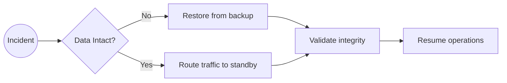

# Disaster Recovery

Documented response for region-wide outages and data loss scenarios.

## Recovery strategy

- **RPO**: 15 minutes via continuous backups.
- **RTO**: 60 minutes to activate standby Railway environment and Cloudflare DNS switch.
- **Backups**: Railway Postgres automated snapshots + object storage export.

## Procedure

1. Declare DR event and assign incident commander.
2. Freeze deploys; capture current state hashes.
3. Promote standby environment using `br-infra deploy core` with `SERVICE=core-standby`.
4. Update DNS CNAME via Terraform Cloudflare module to point to standby endpoints.
5. Validate app health, database consistency, and message queue lag.
6. Document delta changes and plan reversion once primary region stabilizes.
