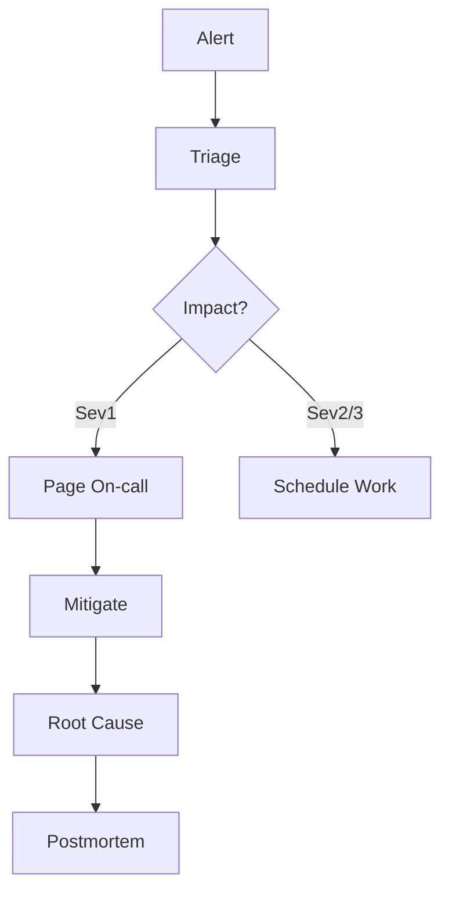

# Incident Response

Use this playbook to coordinate Sev1 incidents across platform and product teams.

## Steps

1. **Acknowledge**: Confirm alert in pager tool within 5 minutes.
2. **Triage**: Identify blast radius and customer impact; declare severity.
3. **Mitigate**: Apply safest rapid mitigation (feature flag, rollback, failover).
4. **Comms**: Update incident channel every 15 minutes; create status page entry if Sev1.
5. **Handoff**: Record timeline, owners, and action items before closing the incident.

## Checklists

- [ ] Logs/metrics reviewed (app + edge)
- [ ] Customer impact measured
- [ ] Rollback path validated
- [ ] Ticket created for follow-up fixes
