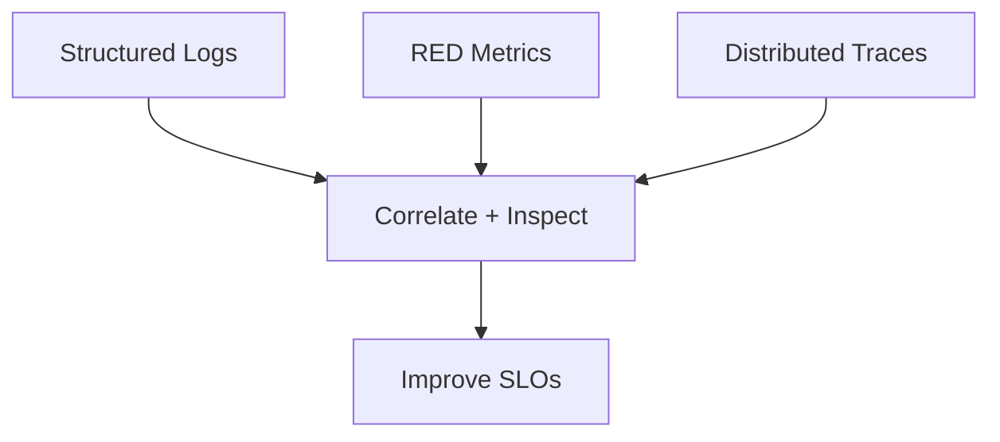

# Observability

Baseline dashboards, alerts, and SLOs for the platform.

## Signals

- **RED metrics**: request rate, error rate, duration per service.
- **Golden signals**: latency, saturation (CPU/memory), and queuing depth.
- **Tracing**: instrument API gateway + core services with W3C trace context.

## Dashboards

- Edge latency + cache hit rate (Cloudflare analytics).
- Railway app health (deploy status, restarts, cold start counts).
- Database health: p95 latency, replication lag, storage growth.

## Alerting rules

- p99 latency > 2s for 5 minutes.
- Error rate > 3% for 5 minutes.
- No deploys in 24h for critical services (stale pipeline alert).
